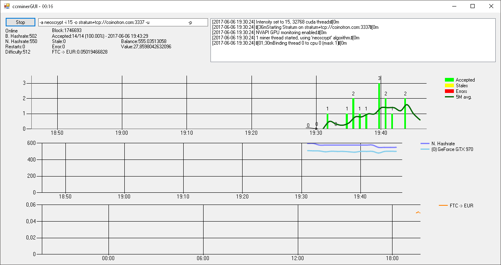

# ccminerGUI
A GUI for the CCMiner for People mining on Coinotron or P2Pool

What is it for? 
it shows some nice graphs of your Hashrate the value of Feathercoin. 
your wallet balance in coin and your desired currency 

Restarts your miner if
<ul>
  <li>
    it dosn't report Hashrates for 5 minutes
  </li>
  <li>
    it chrashes
  </li>
  <li>
    it reports extremely low hashrates
  </li>
</ul>
  

Required: 
<ul>
<li>
  Windows Machine
  </li>
<li>
  .net Framework 4.5.2
  </li>
<li>
  ccminer
  </li>
</ul>
  
Optional: 
<ul>
<li>
  Feathercoin Wallet (For Balance and total Value of your Coins)
  </li>
<li>
  coinotron as your Pool (For Netto Hashrate)
  </li>
<li>
  or p2pool
  </li>
</ul>

Config File (ccminerGUI.exe.config)

    <add key="ccminerArgs" value="-a neoscrypt -i 15 -o stratum+tcp://coinotron.com:3337 -u user.worker -p pass"/>
    <add key="CoinotronAPI" value="Put your API Key here or leave blanc for ignore" />
    <add key="CoinotronWorker" value="the Worker to observe leave blanc for ignore" />
    <add key="Currency" value="eur" />
    <add key="FeathercoinWalletAddress" value="if you want to display it leave blanc for ignore" />
    <add key="p2poolAddress" value="your p2pool address like http://poolip:port" />
